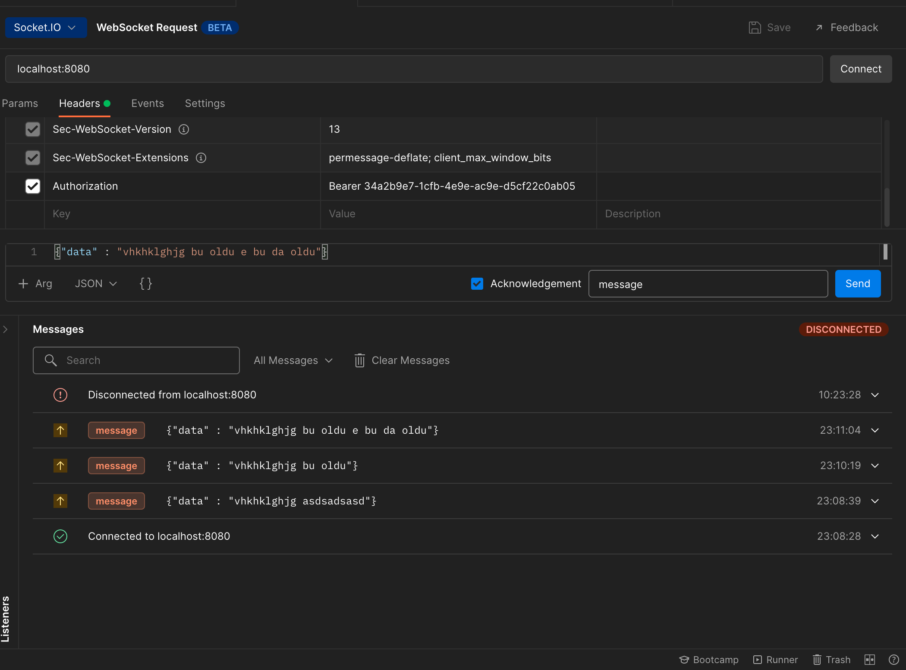
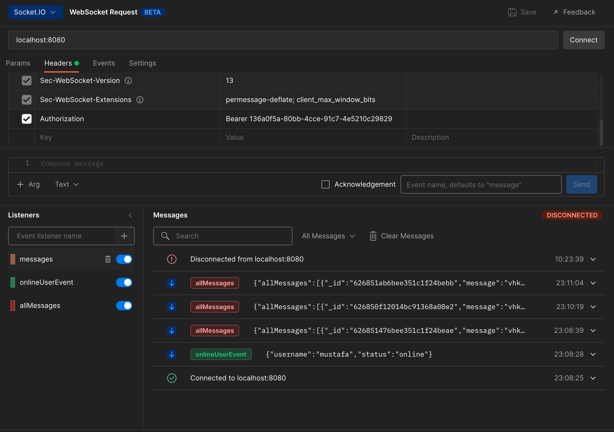
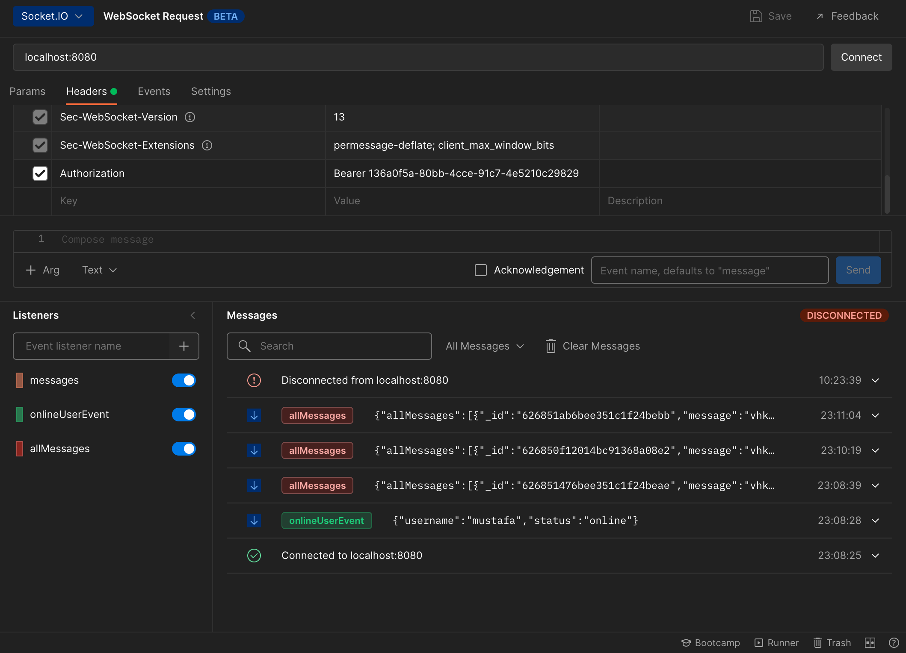

## Installation

```bash
$ npm install
$ docker-compose build
$ docker-compose up
 
```

## Test Scenario
You can use postman collection. (chat.postman_collection.json)
We have 3 api.
- You  should be create user.
- You should be add friend for user.
- You should be update user status. (online, offline)

If you want simulate chat, you can use postman websocket beta version.
Example Screenshots:
[]
You must add  user token to header.
[]
You must add  user token to header and you must add listener.
[]

Everything is working well. You can try all scenario.
You can see examples of all scenarios in the video(caseTest.mov.zip). Actually, I wrote an e2e test, but it was constantly falling on timeout, I couldn't find the reason, so I wanted to show it by taking a video.


